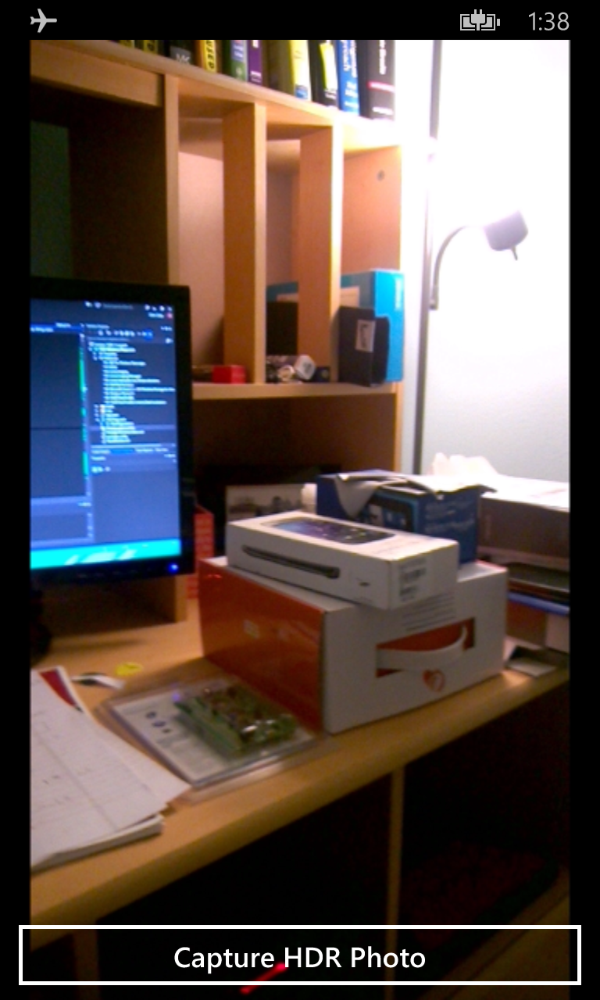

# AdvancedHDR for Windows Phone 8.1
CS 766 HDR app

## Motivation
The AdvancedHDR project was started with the goal of bring a full High Dynamic Range implemented to the WinRT environment. Nokia, one of the world's leaders in digital imaging on smartphones, joined Microsoft several years ago to create Nokia-made Windows Phones. Nokia Pureview technology has brought many new enhancements to smartphone photography, such as the [Nokia Lumia 1020](http://www.microsoft.com/en-us/mobile/phone/lumia1020/), which brings a 41 MP sensor to a smartphone. With these considerations, and without a current implementation in the operating system, it was my goal to show that full HDR photography is fully realizable on a smartphone.

## AdvancedHDR app
With the goal of bringing full HDR imaging to a smartphone, the algorithm by [Debevic et al.](http://www.pauldebevec.com/Research/HDR/debevec-siggraph97.pdf) is implemented in the app. At a high level, the algorithm takes many photos at varying exposure times. Using the over and underexposed images, it is possible to map the small dynamic range of a smartphone into a larger range. In certain capacities, this can produce an image that's much closer to the range that humans see. 

These images are used to find the exposure vs. pixel value response curve for the camera being used. Once the response of the camera is known, a composite images is created using pixels from every bracketed photo, and blended into one photo. This blending process requires using a more raw form of image formatting. While there are several that can be used, the most common is the [.hdr](http://en.wikipedia.org/wiki/RGBE_image_format) file format.

Once the .hdr images are obtained, programs such as [HDR Shop](http://www.hdrshop.com/) can be used to display the .hdr images or run tone mapping algorithms that can map the HDR image to a gamut that is displayable on common displays (eg. computer monitors).

### Details
With the first implementation, AdvancedHDR is a bareboned app. The user is presented with a viewfinder and a single button to take a series of bracketed images at varying exposure rates. The rates are currently fixed. 

#### Capturing
The bracketed photos are taken at varying exposure values (EV). The base implementation doesn't have configurable exposure values, but the range extends from each device's minmum through its maximum exposure value. At present, 5 images are taken, which is the tradeoff for using a smartphone device. The HDR algorithm being used must solve several linear system functions, and the size of the computation is directly proportional to the number of images used. 

Once the images are collected, an optimistic alignment is attempted to correct for any motion displacments between images as that leads to [HDR ghosts](http://www.mediachance.com/hdri/help/clip0016.gif). At present, imaging alignment is done using the [Lumia Imaging SDK](http://developer.nokia.com/lumia/nokia-apis/imaging). This implementation doesn't respond well to extreme changes in exposure, and consequently, alignment typically will fail. Future work looks toward implementing more novel image alignment techniques.

Images are translated into byte pixels within the application for further processing within the HDR algorithm.

#### HDR Algorithm
Using the 5 bracketed images, the HDR algorithm first performs sampling of pixels to be used in determining the camera's response curve. Currently, 128 pixels are sampled from the image with the middle exposure value (typically 0 EV). These pixels are in the range 5 - 250, as the HDR algorithm breaks down in several under and over saturated regions.

The sampled pixels are determined for each color (RGB) in each image to set up the linear system. In additon, the precise exposure time of each image must be known as well. To this end, the [EXIF tags](http://www.exiv2.org/tags.html) for each image are read using an [ExifLib](http://www.codeproject.com/Articles/36342/ExifLib-A-Fast-Exif-Data-Extractor-for-NET) to supply the exact exposure times. The linear system is solved using singular value decomposition (SVD), supplied by the Math.NET library. The camera response for all three colors (RGB) must be solved for, which requires additonal computation time. Once the response curves are determined, they're written to isolated storage should anyone be so inclined to read them.

#### Radiance Maps
To obtain the blended image, a radiance map is developed that combines pixels from all images. The exposure for each pixel in the resulting image is computed by performing a weighted average of all pixel values from the 5 images, along with the response curve value for the pixel in question, while taking the specific image's exposure time into account.

This process creates a new radiance map internally as a byte array. However, for use outside of the program and to develop the final composite image, proper care must be taken to ensure that the image is in a format readable be the software being used. Luckily, the .hdr format mentioned prevously is (somewhat) well documented. The image is converted to an .hdr format, and output to isolated storage as well for further processing. In the future, tone mapping will be done locally on the device.

## Results

## Libraries and Acknowledgments
* [Paul E. Debevec and Jitendra Malik - Recovering High Dynamic Range Radiance Maps from Photographs](http://www.pauldebevec.com/Research/HDR/debevec-siggraph97.pdf)
* [Lumia Imaging SDK](http://developer.nokia.com/lumia/nokia-apis/imaging)
* [Math.NET Numerics] (http://numerics.mathdotnet.com/)
* [ExifLib](http://www.codeproject.com/Articles/36342/ExifLib-A-Fast-Exif-Data-Extractor-for-NET)
* [RGBE Image Format Specifications](http://www.graphics.cornell.edu/online/formats/rgbe/)
